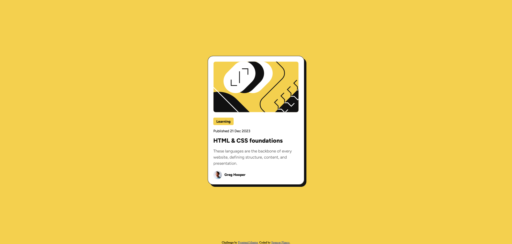

# Frontend Mentor - Blog preview card solution

This is a solution to the [Blog preview card challenge on Frontend Mentor](https://www.frontendmentor.io/challenges/blog-preview-card-ckPaj01IcS). Frontend Mentor challenges help you improve your coding skills by building realistic projects. 

## Table of contents

- [Overview](#overview)
  - [The challenge](#the-challenge)
  - [Screenshot](#screenshot)
  - [Links](#links)
- [My process](#my-process)
  - [Built with](#built-with)
  - [What I learned](#what-i-learned)
  - [Continued development](#continued-development)
  - [Useful resources](#useful-resources)
- [Author](#author)

**Note: Delete this note and update the table of contents based on what sections you keep.**

## Overview

### The challenge

Users should be able to:

- See hover and focus states for all interactive elements on the page

### Screenshot

### Links

- Solution URL: [Add solution URL here](https://your-solution-url.com)
- Live Site URL: https://splanco.github.io/blog-preview-card/

## My process

### Built with

- Semantic HTML5 markup
- CSS custom properties

### What I learned

In this exercise I learned about hosting custom fonts locally, CSS variables, and making components of a page adjust to the users screen size.

### Continued development

I would like to continue work on the mobile version of this page. I see in the original design images, the article image is cropped and given a new aspect ratio for smaller screen sizes. In my solution, I simply scaled the image down, keeping the original aspect ratio.

I would also like to learn more about things such as media queries, vw/vh units, and other ways to make a web page more responsive using just CSS.

### Useful resources

- [Viewport Sized Typography](https://css-tricks.com/viewport-sized-typography/) - I didn't end up using this in the end, but this was an interesting read on a simple way to make text responsive.
- [Using CSS Custom Properties](https://developer.mozilla.org/en-US/docs/Web/CSS/CSS_cascading_variables/Using_CSS_custom_properties) - This was a great way to define a color palette that I could use throughout the entire project.
- [Hosting Fonts Locally](https://developer.mozilla.org/en-US/docs/Learn_web_development/Core/Text_styling/Web_fonts) - I've always linked my fonts on all the web pages I've built, so learning how to host them locally from a file was nice.

## Author

- Website - [Spencer Planco](https://github.com/splanco)
- Frontend Mentor - [@splanco](https://www.frontendmentor.io/profile/splanco)
